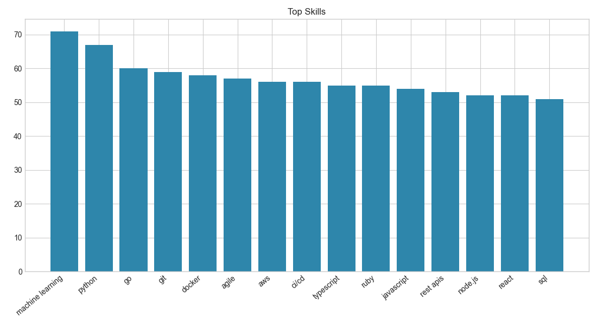
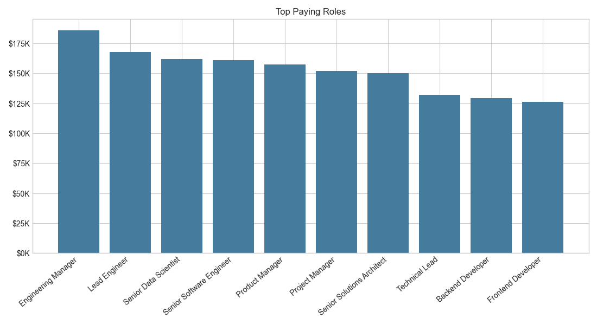
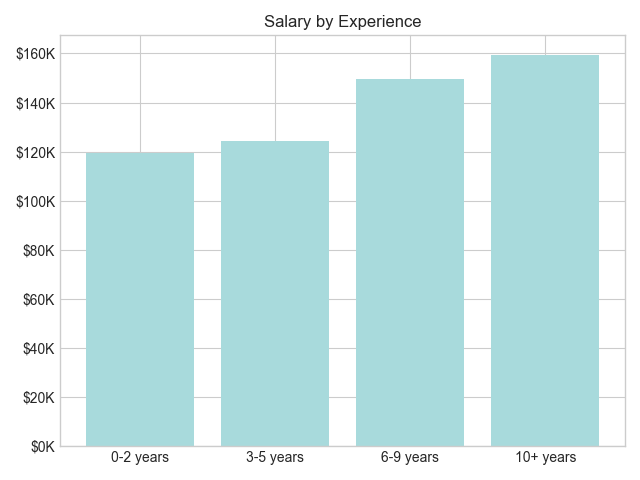
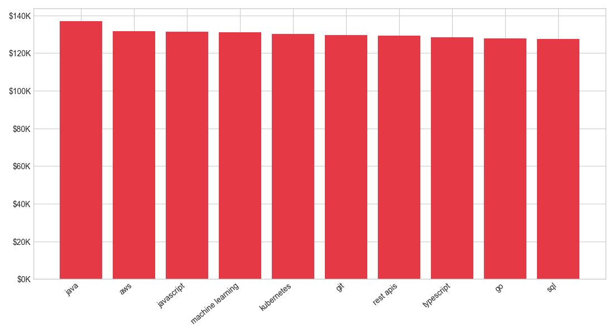
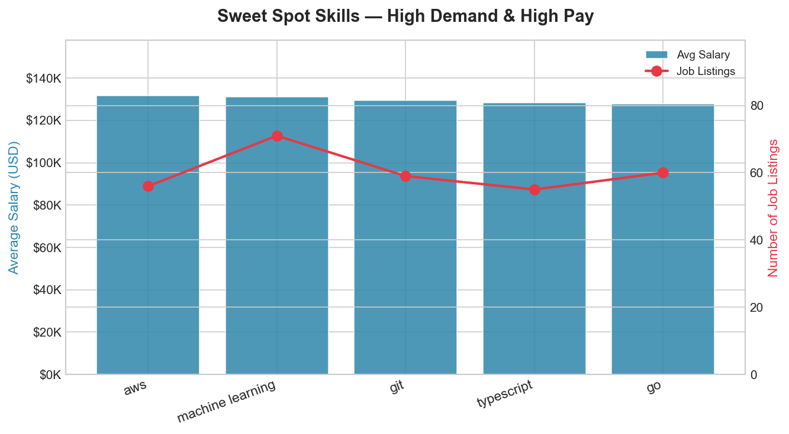

# Tech Job Market Analysis — Python

A data analysis project exploring salary trends, in-demand skills, and market positioning across 201 tech job listings using Python and Matplotlib.

---

## Project Overview

This project cleans and analyses a real-world tech job dataset to answer three practical questions:

- Which skills are most in demand in the current market?
- Which roles and technologies command premium salaries?
- Which skills optimise for both employability and compensation simultaneously?

The analysis goes beyond basic aggregation by incorporating statistical validation (CV, IQR outlier detection), a demand-vs-salary cross-analysis, and location-based salary comparisons.

---

## Tools & Technologies

| Layer | Tool |
|---|---|
| Data processing | Python 3 (Pandas) |
| Visualisation | Matplotlib |
| Dataset source | Kaggle — Tech Jobs Salaries & Skills Dataset |

---

## Dataset

- **Raw records:** 250 job listings
- **Clean records:** 201
- **Features:** 13 columns — job title, company, location, job type, salary range, skills, experience required, education level, company size, benefits
- **Salary handling:** Midpoint of `salary_min` and `salary_max`
- **Experience:** Bucketed into four levels: 0–2, 3–5, 6–9, 10+ years

### Data quality findings

| Issue | Detail |
|---|---|
| Invalid job type labels | 29 records — German-language values and inconsistent casing standardised or removed |
| Non-tech roles | 20 records removed — keyword filter (Account Manager, Mechanic, Finance, etc.) |
| Missing skills | 20% in raw data → 0.5% after non-tech filter (most missing skills were in removed rows) |
| Missing experience | 17% (43 records) — assigned 'Unknown' bucket, excluded from experience analysis |

**Total removed: 49 records** (29 job type filter + 20 non-tech keyword filter)

---

## Data Preparation

1. Standardised column names (lowercase, stripped whitespace)
2. Normalised `job_type` — merged "Full-time"/"Full time" variants, removed non-standard values
3. Filtered to four valid job types: Full Time, Part Time, Contract, Remote
4. Removed non-tech roles using keyword filter
5. Calculated salary midpoint from `salary_min` and `salary_max`
6. Converted `experience_required` to numeric; NaN rows bucketed as 'Unknown'
7. Parsed comma-separated `skills` column into individual rows for aggregation
8. Exported cleaned dataset to `data/cleaned_job_market.csv`

---

## Analysis & Results

### 1. Most in-demand skills



Machine Learning leads with **71 listings (35% of all jobs)**, followed by Python (67, 33%) and Go (60, 30%). Each of the top 15 skills appears in at least 25% of postings — indicating employers expect broad multi-skill coverage rather than depth in a single technology.

Notably, core engineering tools (Git, Docker, CI/CD) appear alongside advanced domains (Machine Learning, Kubernetes), reflecting the market's demand for engineers who combine fundamentals with modern stack capability.

---

### 2. Top paying job roles



Engineering Manager commands the highest average salary at **$185,956** — 45% above the dataset mean of $127,919. The top four roles are all senior or leadership positions, with a clear salary cliff between Senior Software Engineer ($161K) and Technical Lead ($132K).

CV analysis confirms these figures are reliable: Engineering Manager CV = 0.13, Senior Software Engineer CV = 0.11 — low variance indicating consistent compensation at the top of the market.

---

### 3. Salary by experience level



| Experience | Avg Salary | Change |
|---|---|---|
| 0–2 years | $119,386 | — |
| 3–5 years | $124,287 | +$4,901 (+4%) |
| 6–9 years | $149,427 | +$25,140 (+20%) |
| 10+ years | $159,426 | +$9,999 (+7%) |

The steepest jump — **$25,140 or 20%** — occurs between mid-level (3–5 yrs) and senior (6–9 yrs). Early-career growth is modest; the significant salary inflection comes with the transition into senior-impact roles, not simply with years logged.

---

### 4. Highest paying skills



Java leads salary at **$136,922**, followed by AWS ($131,532) and JavaScript ($131,407). The top-paying skills are predominantly backend and cloud technologies.

**The Python paradox:** Python ranks 2nd in demand (67 listings, 33% of jobs) but does not appear in the top-10 salary list. This suggests Python functions as a baseline expectation across roles rather than a salary differentiator — employers assume it, not reward it.

---

### 5. Sweet spot — high demand and high pay



Intersecting the top-10 demand list with the top-10 salary list reveals **5 skills that appear in both**:

| Skill | Listings | Avg Salary |
|---|---|---|
| Machine Learning | 71 (35%) | $130,973 |
| AWS | 56 (28%) | $131,532 |
| Go | 60 (30%) | $127,699 |
| Git | 59 (29%) | $129,430 |
| TypeScript | 55 (27%) | $128,326 |

These are the highest-leverage skills for candidates optimising for both employability and compensation. Notably, Java — the highest-paying skill — does not appear here because its demand ranking falls outside the top 10.

---

### 6. Location-based salary analysis

| Location | Avg Salary | Listings |
|---|---|---|
| Seattle, WA | $159,761 | 13 |
| San Francisco, CA | $158,338 | 14 |
| New York, NY | $149,383 | 20 |
| London, UK | $135,825 | — |
| Remote | $118,953 | 16 |

Seattle and San Francisco lead compensation at $159K and $158K respectively — a **$40K premium (34%) over remote roles** at $118,953. Despite the growth of remote work, top-paying positions remain concentrated in established US tech hubs.

Remote roles are the most represented job type (55 listings), yet carry the lowest average salary among the top locations — a meaningful trade-off for candidates weighing flexibility against compensation.

---

### 7. Statistical validation

| Metric | Value |
|---|---|
| Mean salary | $127,919 |
| Median salary | $119,062 |
| Salary range | $71,428 – $221,214 |
| Salary outliers (IQR method) | 3 |

The mean ($127,919) sits 7% above the median ($119,062), indicating a modest right skew — a small number of high-paying roles pulling the average up. With only 3 outliers detected via IQR, the dataset is sufficiently consistent for directional conclusions.

**Role stability (coefficient of variation):**

| Role | Avg Salary | CV | Interpretation |
|---|---|---|---|
| Engineering Manager | $185,956 | 0.13 | Stable |
| Senior Data Scientist | $161,962 | 0.11 | Very stable |
| Senior Software Engineer | $161,118 | 0.11 | Very stable |
| Technical Lead | $132,037 | 0.14 | Stable |
| Backend Developer | $129,362 | 0.16 | Moderate variance |

Low CV values across top roles confirm the salary figures are reliable and not driven by a few outlier listings.

---

## Key Findings Summary

| Finding | Detail |
|---|---|
| Average salary | $127,919 (median $119,062) |
| Highest paying role | Engineering Manager — $185,956 (45% above mean) |
| Most in-demand skill | Machine Learning — 71 listings (35% of jobs) |
| Highest paying skill | Java — $136,922 avg |
| Sweet spot skills | AWS, Git, Go, Machine Learning, TypeScript |
| Biggest experience jump | Mid → Senior: +$25,140 (+20%) |
| Location premium | Seattle vs Remote: +$40,808 (+34%) |
| Python paradox | 2nd in demand, absent from top-10 salary list |
| Salary outliers | 3 detected — findings are statistically reliable |

---

## Recommendations for Job Seekers

Based on the data, candidates entering or navigating the tech market should consider:

- **Build the sweet spot stack first** — AWS, Machine Learning, Go, TypeScript, and Git are the only skills appearing in both top-10 demand and top-10 salary rankings
- **Treat Python as table stakes, not a differentiator** — it is expected across roles but does not command a salary premium; pair it with Java, AWS, or Kubernetes for compensation leverage
- **Target the mid-to-senior transition deliberately** — the 20% salary jump between 3–5 and 6–9 years is the largest in the career curve; moving into senior-impact roles earlier accelerates this more than tenure alone
- **Weigh location against compensation** — remote roles average $119K vs $159K in Seattle; for candidates optimising for salary, location or targeting high-paying remote roles specifically remains meaningful

---

## Limitations

- Dataset size (201 clean records) is small — findings are directional, not statistically definitive
- Salary values are midpoints of advertised ranges, not actual compensation
- 43 records lacked experience data — excluded from experience analysis
- Geographic cost-of-living not adjusted — $159K in Seattle and $119K remote are not directly comparable
- Dataset is software-engineering heavy — may not fully represent data analyst or BI-specific roles
- Berlin salary ($150K) based on a single listing — excluded from location comparisons

---

## How to Run

```bash
git clone https://github.com/idungamanzi/job-market-analysis.git
cd job-market-analysis
pip install pandas matplotlib
python scripts/analysis.py
```

Outputs are saved automatically:
- Cleaned dataset → `data/cleaned_job_market.csv`
- Charts → `images/`

---

## Project Structure

```
job-market-analysis/
│
├── data/
│   ├── job_market.csv              # raw dataset
│   └── cleaned_job_market.csv      # processed output
│
├── images/
│   ├── top_skills.png
│   ├── top_salaries_by_role.png
│   ├── salary_by_experience.png
│   ├── top_paying_skills.png
│   └── sweet_spot_skills.png
│
├── analysis.py
│
└── README.md
```

---

*Dataset sourced from Kaggle — Tech Jobs Salaries & Skills Dataset.*
